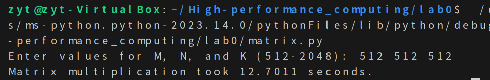
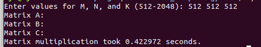
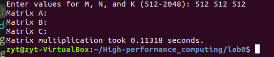
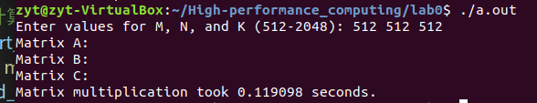

# 实验目的
通用矩阵乘法的实现与优化
# 实验代码及过程
首先，给出C代码和python代码
## C++
```cpp
#include <iostream>
#include <ctime>
#include <cstdlib>

using namespace std;

// 生成随机矩阵
void generateRandomMatrix(float** matrix, int rows, int cols) {
    for (int i = 0; i < rows; ++i) {
        for (int j = 0; j < cols; ++j) {
            matrix[i][j] = static_cast<float>(rand()) / RAND_MAX;
        }
    }
}

// 矩阵乘法
void matrixMultiplication(float** A, float** B, float** C, int M, int N, int K) {
    for (int i = 0; i < M; ++i) {
        for (int j = 0; j < K; ++j) {
            C[i][j] = 0.0;
            for (int k = 0; k < N; ++k) {
                C[i][j] += A[i][k] * B[k][j];
            }
        }
    }
}

int main() {
    int M, N, K;
    cout << "Enter values for M, N, and K (512-2048): ";
    cin >> M >> N >> K;

    if (M < 512 || M > 2048 || N < 512 || N > 2048 || K < 512 || K > 2048) {
        cout << "Invalid input. All values must be between 512 and 2048." << endl;
        return 1;
    }

    // 分配内存并初始化矩阵
    float** A = new float*[M];
    float** B = new float*[N];
    float** C = new float*[M];

    for (int i = 0; i < M; ++i) {
        A[i] = new float[N];
        C[i] = new float[K];
    }

    for (int i = 0; i < N; ++i) {
        B[i] = new float[K];
    }

    // 生成随机矩阵
    srand(static_cast<unsigned>(time(nullptr)));
    generateRandomMatrix(A, M, N);
    generateRandomMatrix(B, N, K);

    // 计算矩阵乘法的时间
    clock_t startTime = clock();
    matrixMultiplication(A, B, C, M, N, K);
    clock_t endTime = clock();
    double elapsedTime = static_cast<double>(endTime - startTime) / CLOCKS_PER_SEC;

    cout << "Matrix A:" << endl;
    // 输出矩阵A的内容

    cout << "Matrix B:" << endl;
    // 输出矩阵B的内容

    cout << "Matrix C:" << endl;
    // 输出矩阵C的内容

    cout << "Matrix multiplication took " << elapsedTime << " seconds." << endl;

    // 释放分配的内存
    for (int i = 0; i < M; ++i) {
        delete[] A[i];
        delete[] C[i];
    }

    for (int i = 0; i < N; ++i) {
        delete[] B[i];
    }

    delete[] A;
    delete[] B;
    delete[] C;

    return 0;
}
```
## python

```python
import random
import time

# 生成随机矩阵
def generate_random_matrix(rows, cols):
    matrix = []
    for i in range(rows):
        row = [random.random() for _ in range(cols)]
        matrix.append(row)
    return matrix

# 矩阵乘法
def matrix_multiplication(A, B):
    M = len(A)
    N = len(A[0])
    K = len(B[0])
    C = [[0.0 for _ in range(K)] for _ in range(M)]
    
    for i in range(M):
        for j in range(K):
            for k in range(N):
                C[i][j] += A[i][k] * B[k][j]
    
    return C

def main():
    M, N, K = map(int, input("Enter values for M, N, and K (512-2048): ").split())

    if M < 512 or M > 2048 or N < 512 or N > 2048 or K < 512 or K > 2048:
        print("Invalid input. All values must be between 512 and 2048.")
        return 1

    # 生成随机矩阵
    random.seed(time.time())
    A = generate_random_matrix(M, N)
    B = generate_random_matrix(N, K)

    # 计算矩阵乘法的时间
    start_time = time.time()
    C = matrix_multiplication(A, B)
    end_time = time.time()
    elapsed_time = end_time - start_time

    # print("Matrix A:")
    # for row in A:
    #     print(row)

    # print("Matrix B:")
    # for row in B:512
    #     print(row)

    # print("Matrix C:")
    # for row in C:
    #     print(row)

    print(f"Matrix multiplication took {elapsed_time:.4f} seconds.")

if __name__ == "__main__":
    main()
```
然后分别指定两个矩阵的行和列都是512

C++结果如下


python结果如下


不难看出，python运算比C++慢得多，符合一般情况。

循环顺序优化



速度变快了

再进行编译优化，



可以看出又快了许多。

再利用-O3编译



变化的不是很明显。

# 实验结果
| 版本 | 实现                | 运行时间 (s) | 相对加速比 (相对前一版本) | 绝对加速比 (相对版本1) | 浮点性能 (GFLOPS) | 达到峰值性能的百分比 |
|------|---------------------|--------------|-----------------------------|-------------------------|-------------------|------------------------|
| 1    | Python              |         12.7011     |         1                    |     1                    |       0.001            |        0.001                |
| 2    | C                   |           0.428067   |              29.67               |         29.67                |          0.114        |                 0.012       |
| 3    | +调整循环顺序       |         0.422972     |              1.012               |                 30.09        |         0.686         |         0.085               |
| 4    | +编译优化           |       0.11318       |             3.743                |           112.38              |             1.972    |           0.201            |

# 实验感想

1. 认识到了编译优化带来的好处。
2. 认识到C++的优越性。