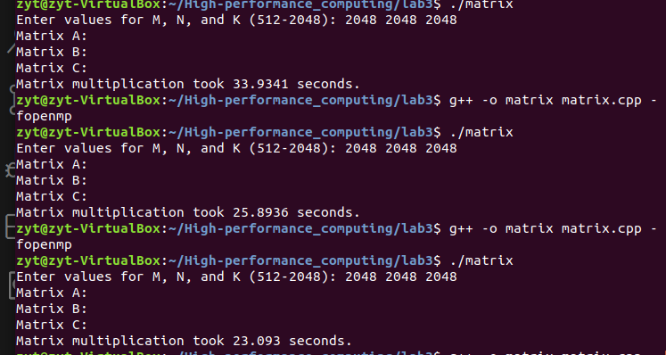
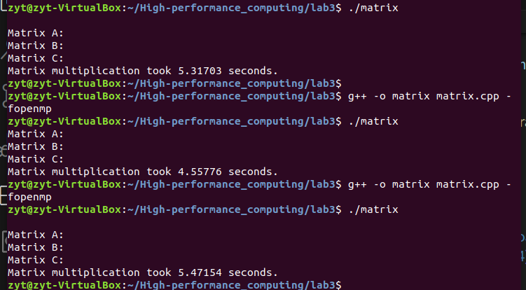
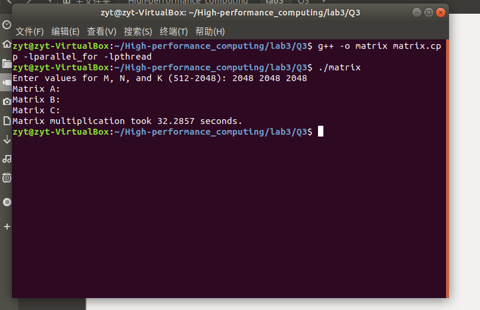

# 实验目的
1. 通过OpenMP实现通用矩阵乘法   
熟练掌握OpenMP原理，完成通用矩阵乘法的OpenMP实现，为后续实验打下基础。

1. 基于OpenMP的通用矩阵乘法优化   
进一步熟悉OpenMP的任务调度机制，分别采用OpenMP的默认任务调度机制、静态调度和动态调度实现#pragma omp for，比较性能。

1. 构造基于Pthreads的并行for循环分解、分配和执行机制   
学习Pthreads多线程库提供的函数，构建parallel_for 函数对循环分解、分配和执行机制，将基于 OpenMP 的通用矩阵乘法的omp parallel for 并行，改造成基于parallel_for 函数并行化的矩阵乘法。
# 实验过程和核心代码
1.	通过OpenMP实现通用矩阵乘法    
```c
#pragma omp parallel num_threads(thread_count)
```
只需在矩阵相乘的前段加上这段代码即可。



可以看到速度确实加快了。

2. 通用矩阵乘法优化

分别利用三个不同语句而已，比较简单。



可以看到时间上没有明显差别，猜测可能是因为每个计算的计算量差不多的原因。

3. 构造基于Pthreads的并行for循环分解、分配和执行机制 
```c
#include "parallel_for.h"
#include <pthread.h>
pthread_t pid[1000];

void parallel_for(int start,int end,int increment, void*(*functor)(void*), void *arg, int num_threads){
	int counts=end-start;
	int threads=num_threads;
	if(num_threads>=counts) threads=counts;
	int average_loop=counts/num_threads;
	for(int thread = 0; thread<threads; thread++){
		struct for_index * idx = new for_index;
		idx->start=average_loop*thread;
		idx->increment=increment;
		if(thread < threads-1){		
			idx->end=average_loop*(thread+1)-1;
		}else{
			idx->end=counts-1;		
		
		}
		pthread_create(&(pid[thread]), NULL, functor, (void*) idx);		
	}
	//线程合并进程
	for (int thread=0; thread<threads; thread++)
        pthread_join(pid[thread], NULL);
} 
```
这和之前的思路一样，按照行数和线程数进行划分。

```c
void *functor(void* args) {
    struct for_index * idx = (struct for_index *) args;
    int first=idx->start;
	int last=idx->end;
	int increment=idx->increment;
    for (int i = first; i<=last; i+=increment) {
        for (int k = 0; k < N; ++k) {
            for (int j = 0; j < K; ++j) {
                C[i][j] += A[i][k] * B[k][j];
            }
        }
    }
}
```
按照行数进行矩阵乘法。
# 实验结果

1.	通过OpenMP实现通用矩阵乘法  

| 规模和线程 | 512 | 1024 | 2048 |
|-----|-----|-----|-----|
|   1 |  0.274  |  2.321 |  72。13  |
| 2  |  0.134  |  1.134|  31.32  |
|  4  |  0.0732 |  0.563  |  14.21  |

2.通用矩阵乘法优化

已经进行展示

3.构造基于Pthreads的并行for循环分解、分配和执行机制



4. 实验感想
经过本次实验体会到了OpenMP编程的简介，同时自己进行库函数的编写，加深了对C++的体会。