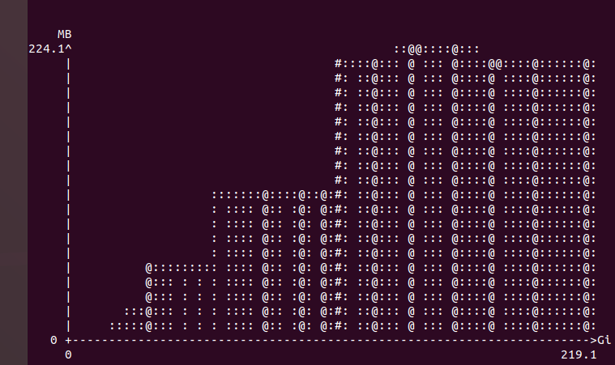

# 实验目的
任务1：
通过实验3构造的基于Pthreads的parallel_for函数替换fft_serial应用中的某些计算量较大的“for循环” ,实现for循环分解、分配和线程并行执行。

任务2（二选一）：
1.	将fft_serial应用改造成基于MPI的进程并行应用（为了适合MPI的消息机制，可能需要对fft_serial的代码实现做一定调整）。Bonus:使用MPI_Pack/MPI_Unpack，或MPI_Type_create_struct实现数据重组后的消息传递。

2.	将heated_plate_openmp应用改造成基于MPI的进程并行应用。Bonus:使用MPI_Pack/MPI_Unpack，或MPI_Type_create_struct实现数据重组后的消息传递。

任务3：
性能分析任务：对任务1实现的并行化fft应用在不同规模下的性能进行分析，即分析：
1）不同规模下的并行化fft应用的执行时间对比；
2）不同规模下的并行化fft应用的内存消耗对比。
本题中，“规模”定义为“问题规模”和“并行规模”；“性能”定义为“执行时间”和“内存消耗”。
其中，问题规模N，值为2，4，6，8，16，32，64，128，……， 2097152；并行规模，值为1，2，4，8进程/线程。

# 实验过程及代码
1. ***parallel_for函数***


   1. **ThreadData 结构体:**
    ```c
    typedef struct {
        int start; 
        int end;
        int increment;
        int n;
        double* x;
        double* y;
        double* w;
        double sgn;
    } ThreadData;
    ```
    这个结构体用于保存将传递给每个线程的数据。它包含了一些信息，比如线程应该执行的迭代范围（`start` 和 `end`）、步长（`increment`）、数据数组的大小（`n`），以及指向数组 `x`、`y` 和 `w` 的指针。变量 `sgn` 似乎表示FFT计算的符号。

   2. **parallel_fft 函数:**
    ```c
    void* parallel_fft(void* arg) {
        ThreadData* data = (ThreadData*)arg;
        void cfft2 ( int n, double x[], double y[], double w[], double sgn );

        for (int it = data->start; it < data->end; it++) {
            data->sgn = +1.0;
            cfft2(data->n, data->x, data->y, data->w, data->sgn);
            data->sgn = -1.0;
            cfft2(data->n, data->y, data->x, data->w, data->sgn);
        }

        pthread_exit(NULL);
    }
    ```
    这是每个pthread将执行的函数。首先将输入参数 `arg` 转换为 `ThreadData` 指针。然后，它在由 `ThreadData` 结构中的 `start` 和 `end` 指定的迭代范围内进行迭代。
·3. **修改后的for循环**
    ```cpp
       for (int i = 0; i < num_threads; i++) {
        // Calculate the end index for each thread
        int end = start + iterations_per_thread + (i < remaining_iterations ? 1 : 0);

        // Assign data to the thread-specific structure
        thread_data[i].start = start;
        thread_data[i].end = end;
        thread_data[i].n = n;
        thread_data[i].x = x;
        thread_data[i].y = y;
        thread_data[i].w = w;

        // Create threads
        pthread_create(&threads[i], NULL, parallel_fft, (void*)&thread_data[i]);
       
        // Update the start index for the next thread
        start = end;
    }
    auto start_time = std::chrono::high_resolution_clock::now();
    // Wait for all threads to finish
    for (int i = 0; i < num_threads; i++) {
        pthread_join(threads[i], NULL);
    }
    free(threads);
    free(thread_data);
    auto end_time = std::chrono::high_resolution_clock::now();
    auto elapsed_time = std::chrono::duration_cast<std::chrono::microseconds>(end_time - start_time);
    ```
    这段代码首先进行线程的创建和分配，然后等待线程完成进行时间的测量。为了记录墙上时钟，利用了C++里面的 `chrono` 库函数，能够更精确记录完成的时间。

2. ***MPI应用更改***
```cpp
  while (epsilon <= diff) {
    // Scatter the data to each process
    MPI_Scatter(w, rows_per_proc * N, MPI_DOUBLE, pack_buffer, rows_per_proc * N, MPI_DOUBLE, 0, MPI_COMM_WORLD);
    // Unpack the received data
    int position = 0;
  for (int i = 1; i < rows_per_proc+1; i++) {
  for (int j = 0; j < N; j++) {
    local_w[i][j] = pack_buffer[position++];
  }
}
 for (int j = 0; j < N; j++) {
  local_w[0][j]=0.0;
  local_w[ rows_per_proc+1][j]=0.0;
 }
//  for(int i=0;i<=rows_per_proc+1;i++){
//   for(int j=0;j<N;j++){
//     printf(" %f ",local_w[i][j]);
//   }

//   printf("\n");
//  }
   MPI_Sendrecv(&local_w[rows_per_proc][0],N,MPI_DOUBLE,right,1,&local_w[0][0],N,MPI_DOUBLE,left,1,MPI_COMM_WORLD, MPI_STATUS_IGNORE);
   MPI_Sendrecv(&local_w[1][0],N,MPI_DOUBLE,left,2,&local_w[rows_per_proc+1][0],N,MPI_DOUBLE,right,2,MPI_COMM_WORLD, MPI_STATUS_IGNORE);

  
    // Each process performs its local computation
    my_diff = 0.0;
    if(rank==0){
        begin_row=2;
    }
    if(rank==size-1){
        end_row=rows_per_proc-2;
    }
      for (int i = begin_row; i < end_row; i++) {
      for (int j = 1; j < N - 1; j++) {
        local_u[i][j] = (local_w[i - 1][j] + local_w[i + 1][j] + local_w[i][j - 1] + local_w[i][j + 1]) / 4.0;
        if (my_diff < fabs(local_w[i][j] - local_u[i][j])) {
          my_diff = fabs(local_w[i][j] - local_u[i][j]);
        }
      }
    }
//      for(int i=0;i<=rows_per_proc+1;i++){
//   for(int j=0;j<N;j++){
//     printf(" %f ",local_w[i][j]);
//   }
//   printf("\n");
//  }
//  printf("*********************************************************************************\n");
    // Pack the local result for sending
    for (int i = begin_row; i < end_row; i++) {
      for (int j = 1; j < N-1; j++) {
        local_w[i][j]=local_u[i][j];
      }
    }
//      for(int i=0;i<=rows_per_proc+1;i++){
//   for(int j=0;j<N;j++){
//     printf(" %f ",local_w[i][j]);
//   }
//   printf("\n");
//  }
//  printf("*********************************************************************************\n");
     position = 0;
    for (int i = 1; i < rows_per_proc+1; i++) {
      for (int j = 0; j < N; j++) {
        pack_buffer[position++] = local_w[i][j];
      }
    }
    MPI_Barrier(MPI_COMM_WORLD);
    // Gather the local results back to the root process
    MPI_Gather(pack_buffer, rows_per_proc * N, MPI_DOUBLE, w, rows_per_proc * N, MPI_DOUBLE, 0, MPI_COMM_WORLD);

    // Reduce the maximum difference across all processes
    MPI_Reduce(&my_diff, &diff, 1, MPI_DOUBLE, MPI_MAX, 0, MPI_COMM_WORLD);

```
这段代码的作用就是将这个矩阵按行分块，然后每行多加上下两行，用于接收他邻近的行的数据，然后在首行和尾行进行特殊设置，他们是不需要进行迭代的。

3. ***内存和时间分析***


上面显示了1，2，4，8个线程进行计算的结果，因为我发现源代码在最后的迭代只有一次，这样的话就会导致吧多线程不会起作用，于是我另最后的迭代次数为8，方便观察多线程的性能。





在更改问题规模的时候我发现，无论怎么更改线程数量，内存占用并没有太大变化，可能是因为多线程利用的是共享变量的原因。

# 实验结果

1.  
   展示在问题3中。
2. 


可以看到处理的时间明显减少了许多。

3.

在实验过程已经展示。

# 实验反思

加深了多线程编程和mpi编程的理解，同时在实验的过程中遇到不少问题，因为多线程和mpi调试比较麻烦，花费了不少时间。