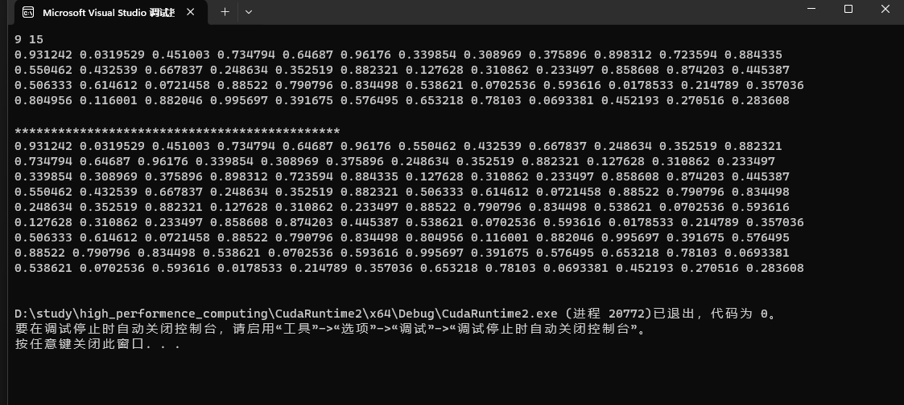

# 任务一
## 实验目的
通过CUDA实现通用矩阵乘法（Lab1）的并行版本，CUDA Thread Block size从32增加至512，矩阵规模从512增加至8192。
## 实验过程及代码
```cpp
// CUDA核函数：矩阵乘法
__global__ void matrixMul(float* a, float* b, float* c) {
    int row = blockIdx.y * blockDim.y + threadIdx.y;
    int col = blockIdx.x * blockDim.x + threadIdx.x;

    if (row < N && col < N) {
        float sum = 0.0f;
        for (int i = 0; i < N; ++i) {
            sum += a[row * N + i] * b[i * N + col];
        }
        c[row * N + col] = sum;
    }
}
```
这个核函数比较简单通过输出的矩阵的规模定义网格和线程块，然后找到它的索引，通过索引计算矩阵乘法。
# 实验结果
| Matrix Size\Block Size | 32x32 | 64x64 | 128x128 | 256x256 | 512x512 |
|------------|-------|-------|---------|---------|---------|
| 512x512    | 0.821088  | 0.62432   | 0.643136 | 0.696   | 0.634816  |
| 1024x1024  | 3.48045   | 2.32614   | 2.35139  | 2.40275 | 2.40058   |
| 2048x2048  | 19.2713   | 10.749    | 10.6137  | 10.6615 | 10.6741   |
| 4096x4096  | 111.642   | 42.5023   | 42.7522  | 42.6555 | 42.308    |
| 8192x8192  | 663.646   | 170.131   | 169.906  | 169.278 | 169.399   |

我们可以看到随着矩阵规模增加运行时间越来越长，符合一般规律，同时发现在线程块增加到一定规模之后，时间的优化不明显了。


# 任务二
## 实验目的 
通过NVDIA的矩阵计算函数库CUBLAS计算矩阵相乘，矩阵规模从512增加至8192，并与任务1和任务2的矩阵乘法进行性能比较和分析，如果性能不如CUBLAS，思考并文字描述可能的改进方法

## 实验过程及代码

```cpp
   cublasSgemm(handle, CUBLAS_OP_N, CUBLAS_OP_N, n, n, n, &alpha, d_A, n, d_B, n, &beta, d_C, n);
```
这个任务比较简单，只需要查询英伟达相关文档就可以了。

## 实验结果

| Matrix Size | Time (ms)   |
|-------------|-------------|
| 512         | 0.053376    |
| 1024        | 0.216992    |
| 2048        | 1.41158     |
| 4096        | 10.8574     |
| 8192        | 84.0638     |

可能的优化方法：


1. **使用纹理内存：** 在某些情况下，将输入数据存储在 CUDA 纹理内存中可以提供更快的读取性能。这对于特定访存模式可能会有帮助。

4. **使用 warp 优化：** Warp 是 GPU 中一组线程的基本执行单元。确保你的代码充分利用 warp 内部并行性，这有助于提高效率。

5. **使用专用库：** 如果你的应用程序只是为了矩阵乘法，而没有其他更通用的计算需求，考虑使用专门的线性代数库，如 cuBLAS。这些库经过高度优化，通常能够提供最佳的性能。

6. **CUDA Warp-Level Primitives：** 在最新的 CUDA 版本中，NVIDIA 引入了 warp-level 原语，这些原语允许在 warp 级别执行操作，可能对提高性能有帮助。


# 任务三
## 实验目的
在信号处理、图像处理和其他工程/科学领域，卷积是一种使用广泛的技术。在深度学习领域，卷积神经网络(CNN)这种模型架构就得名于这种技术。在本实验中，我们将在GPU上实现卷积操作，注意这里的卷积是指神经网络中的卷积操作，与信号处理领域中的卷积操作不同，它不需要对Filter进行翻转，不考虑bias
## 实验过程及代码
```cpp
__global__ void convolution2D(float* input, float* kernel, float* output,
                              int inputHeight, int inputWidth, int kernelSize,
                              int outputHeight, int outputWidth, int stride) {
    int i = blockIdx.x * blockDim.x + threadIdx.x;
    int j = blockIdx.y * blockDim.y + threadIdx.y;

    if (i < outputHeight && j < outputWidth) {
        int outputIdx = i * outputWidth + j;
        output[outputIdx] = 0.0;

        for (int ci = 0; ci < 3; ++ci) {
            for (int ki = 0; ki < kernelSize; ++ki) {
                for (int kj = 0; kj < kernelSize; ++kj) {
                    int inputI = i * stride + ki;
                    int inputJ = j * stride + kj;
                    int inputIdx = (inputI * inputWidth + inputJ) * 3 + ci;

                    int kernelIdx = (ki * kernelSize + kj) * 3 + ci;

                    output[outputIdx] += input[inputIdx] * kernel[kernelIdx];
                }
            }
        }
    }
}
```
这段代码简单的进行了四层循环，没有对循环优化，假设矩阵存储方式为HWC,实现思路和矩阵乘法相似。
### 实验结果

| Matrix Size      | Time (ms)        |
|-------------------|------------------|
| 256 x 256         | 0.095552         |
| 512 x 512         | 0.288608         |
| 1024 x 1024       | 0.992288         |
| 2048 x 2048       | 3.70038          |
| 4096 x 4096       | 15.1807          |

可以看到随着矩阵规模的增加，运行时间增加。


# 任务四
## 实验目的
使用im2col方法结合任务1实现的GEMM（通用矩阵乘法）实现卷积操作。输入从256增加至4096或者输入从32增加至512，具体实现的过程可以参考下面的图片和参考资料。
## 实验过程及代码
```cpp
// 矩阵转化
__global__ void converttomatrix(float* input, float* outmatrix,
    int inputHeight, int inputWidth, int inputChannels,
    int filterHeight, int filterWidth, int filterChannels,
    int outmatrixwidth, int outmatrixheight,
    int outputheight, int outputwidth) {
    int i = blockIdx.y * blockDim.y + threadIdx.y;
    int j = blockIdx.x * blockDim.x + threadIdx.x;

    if (i < outmatrixheight && j < outmatrixwidth) {
        outmatrix[i * outmatrixwidth + j] = input[((i / outputheight + j / inputChannels / filterHeight) * inputWidth + i % outputwidth + j / inputChannels % filterWidth) * filterChannels + j % inputChannels];
    }
}
// 矩阵乘法
__global__ void matrixMultiply(float* a, float* b, float* c, int m, int n, int k) {
    int i = blockIdx.x * blockDim.x + threadIdx.x;
    int j = blockIdx.y * blockDim.y + threadIdx.y;
    double sum = 0;
    if (i < m && j < k) {
        for (int x = 0; x < n; x++) {
            sum += a[i * n + x] * b[x * k + j];
        }
        c[i * k + j] = sum;
    }
}
```
对矩阵转化函数做一个简单的验证


发现符合。

这个任务的核心就是先转化为矩阵，然后再进行矩阵乘法。
## 实验结果

| Input Matrix Size | Time (ms) |
|-------------------|-----------|
| 256x256           | 0.073696  |
| 512x512           | 0.197696  |
| 1024x1024         | 0.661184  |
| 2048x2048         | 1.5841    |
| 4096x4096         | 6.35414   |


# 任务五
## 实验目的
使用cuDNN提供的卷积方法进行卷积操作，记录其相应Input的卷积时间，与自己实现的卷积操作进行比较。如果性能不如cuDNN，用文字描述可能的改进方法。
## 实验过程及代码
```cpp
    CUDNN_CHECK(cudnnCreateTensorDescriptor(&inputDesc));
    CUDNN_CHECK(cudnnSetTensor4dDescriptor(inputDesc, CUDNN_TENSOR_NCHW, CUDNN_DATA_FLOAT,
                                           1, inputChannels, inputHeight, inputWidth));
    cudnnFilterDescriptor_t filterDesc;
    CUDNN_CHECK(cudnnCreateFilterDescriptor(&filterDesc));
    CUDNN_CHECK(cudnnSetFilter4dDescriptor(filterDesc, CUDNN_DATA_FLOAT, CUDNN_TENSOR_NCHW,
                                           1, filterChannels, filterHeight, filterWidth));

    cudnnConvolutionDescriptor_t convDesc;
    CUDNN_CHECK(cudnnCreateConvolutionDescriptor(&convDesc));
    CUDNN_CHECK(cudnnSetConvolution2dDescriptor(convDesc, 0, 0, stride, stride, 1, 1,
                                                 CUDNN_CONVOLUTION, CUDNN_DATA_FLOAT));
    int out_n;
    int out_c;
    int out_h;
    int out_w;
      
    CUDNN_CHECK(cudnnGetConvolution2dForwardOutputDim(
          convDesc, inputDesc, filterDesc,
          &out_n, &out_c, &out_h, &out_w));

    CUDNN_CHECK(cudnnCreateTensorDescriptor(&outputDesc));
    CUDNN_CHECK(cudnnSetTensor4dDescriptor(outputDesc, CUDNN_TENSOR_NCHW, CUDNN_DATA_FLOAT,
                                           out_n, out_c, out_h, out_w));
    float *out_data;
    CUDA_CHECK(cudaMalloc(
          &out_data, out_n * out_c * out_h * out_w * sizeof(float)));
    // algorithm
    const int requestedAlgoCount = 1;
    int returnedAlgoCount;

    // Use an array to store performance results
    cudnnConvolutionFwdAlgoPerf_t perfResults[1];

    CUDNN_CHECK(cudnnGetConvolutionForwardAlgorithm_v7(cudnn,
                                                       inputDesc,
                                                       filterDesc,
                                                       convDesc,
                                                       outputDesc,
                                                       requestedAlgoCount,
                                                       &returnedAlgoCount,
                                                       perfResults));

    // Get the chosen algorithm
    cudnnConvolutionFwdAlgo_t algo = perfResults[0].algo;
    // workspace size && allocate memory
    size_t workspace_size = 0;
    CUDNN_CHECK(cudnnGetConvolutionForwardWorkspaceSize(cudnn,
                                                        inputDesc,
                                                        filterDesc,
                                                        convDesc,
                                                        outputDesc,
                                                        algo,
                                                        &workspace_size));

    void * workspace = nullptr;
    CUDA_CHECK(cudaMalloc(&workspace, workspace_size));
    std::cerr << "Workspace size: " << (workspace_size/ 1048576.0) << "MB"
          << std::endl;
    // Perform convolution using cuDNN
    cudaEvent_t start, stop;
    CUDA_CHECK(cudaEventCreate(&start));
    CUDA_CHECK(cudaEventCreate(&stop));

    // Assume alpha is defined
    float alpha = 1.0f, beta = 0.0f;
    CUDA_CHECK(cudaEventRecord(start));
    CUDNN_CHECK(cudnnConvolutionForward(cudnn, &alpha, inputDesc, d_input,
                                        filterDesc, d_filters, convDesc,
                                        algo,
                                        workspace, workspace_size, &beta, outputDesc, out_data))；
```

这个代码的流程就是先转化张量，选择最优算法，然后进行计算。

同时我发现在cudnn v8版本中会出现运行时间异常的情况，改成v7版本问题解决，猜测可能的原因是GPU型号不匹配。
### 实验结果
| Matrix Size | Workspace size (MB) | cuDNN Convolution Time (ms) |
|-------------|---------------------|-----------------------------|
| 256x256     | 0.369171            | 0.069888                    |
| 512x512     | 1.48831             | 0.108224                    |
| 1024x1024   | 5.97659             | 0.332864                    |
| 2048x2048   | 23.9532             | 0.986848                    |
| 4096x4096   | 95.9063             | 3.81059                     |

可以看到使用官方的API时，运行时间显著减少。

可能的改进方法：

1. **并行度与优化：** 确保你的自定义卷积实现充分利用 GPU 的并行性。使用共享内存 (Shared Memory) 可以减少全局内存访问，从而提高性能。同时，适当选择线程块大小和网格大小。

2. **使用 Warp 优化：** 充分利用 CUDA warp 内部的并行性。确保你的代码中没有数据依赖性，以便 warp 中的线程能够以最大的并行方式执行。

3. **纹理内存：** 将输入数据存储在 CUDA 纹理内存中，以提高读取性能。在卷积操作中，纹理内存可能对性能有所帮助。

4. **异步操作：** 如果可能，考虑使用异步操作。在 GPU 上执行计算的同时，可以在 CPU 上执行其他任务，提高整体效率。

5. **算法优化：** 考虑优化卷积算法。可能存在一些针对特定硬件架构的算法优化，可以在不同的硬件上提供更好的性能。

6. **使用 Warp-Level Primitives：** 在最新的 CUDA 版本中，NVIDIA 引入了 warp-level 原语，这些原语可以在 warp 级别执行操作，有助于提高效率。

7. **CUDA 核函数的调整：** 根据具体情况，调整核函数中的代码结构和逻辑，以最大程度地利用 GPU 计算资源。

8. **优化内存访问模式：** 减少全局内存访问，最小化缓存未命中。使用局部变量或共享内存来存储重复使用的数据。


